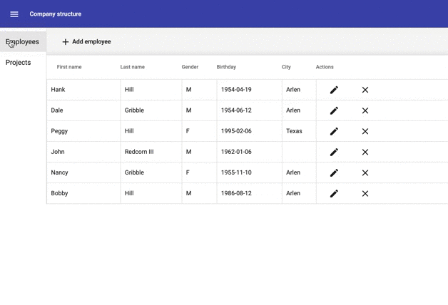

[](https://travis-ci.com/shpotainna/company-structure)
[](https://codecov.io/gh/shpotainna/company-structure)

Company Structure 
=================

A simple CDUD application representing a company structure.

The application is built using Java 11, Spring Boot 2 and PostgreSQL on the backend, Angular 8 and TypeScript on the frontend, Docker for building and running.



## Environment Setup

You need to have Docker to be able to build and run the application.

## How to build and run

1. Build the backend application image

    ```docker build -t=cs-backend -f Dockerfile.backend .```
    
2. Build the frontend application image

    ```docker build -t=cs-frontend -f Dockerfile.frontend .```
    
3. Create a docker network

    ```docker network create cs-net```

4. Start the database 

    ```
    docker run -p 5432:5432 \
      -e POSTGRES_USER=company-structure \
      -e POSTGRES_PASSWORD=company-structure \
      -e POSTGRES_DB=company-structure \
      --name cs-db \
      --net=cs-net \
      postgres:11.5
    ```
    
5. Start the backend

    ```
    docker run --name=cs_backend \
         --net=cs-net \
         -p 8080:8080 \
         cs-backend:latest
    ```    
6. Start the frontend

    ```
    docker run --name=cs_frontend \
         -p 4200:4200 \
         cs-frontend:latest
    ```

The application is accessible on http://localhost:4200.
